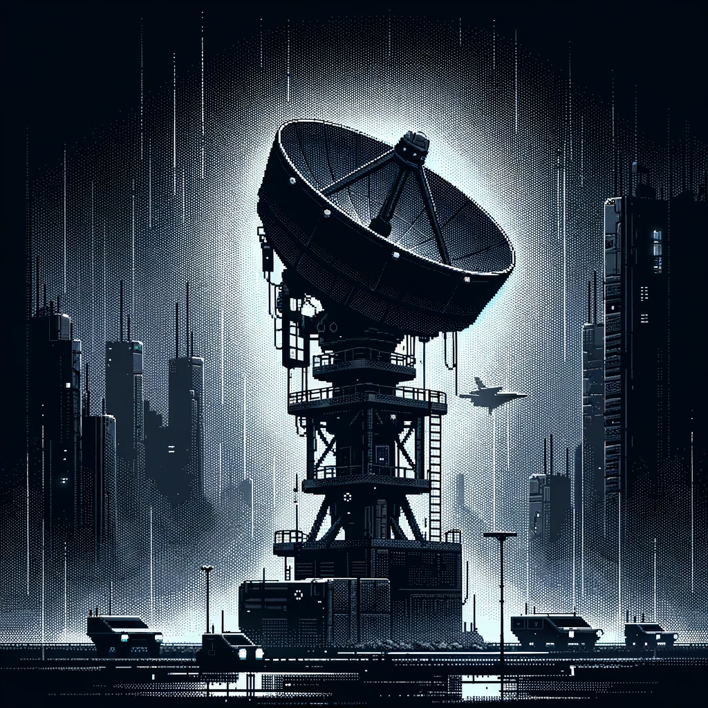

# <h1 align="center"> massa-sc-scanner </h1>

    

    📡 Massa smart contract bytecode scanner 📡

Cover by [DALL-E](https://openai.com/dall-e-3/).

## Table of Contents

- [Introduction](#introduction)
- [Contributing](#contributing)
- [Acknowledgements](#acknowledgements)
- [Authors](#authors)

## Introduction

Coming soon.

## Contributing

We welcome contributions from everyone. Please refer to the [contributing guidelines](CONTRIBUTING.md) for more information.

## Acknowledgements

## Authors

This project is maintained by the 📡 at [Quartz](https://quartz.technology).

It is being developed with the help of [0xtekgrinder](https://github.com/0xtekgrinder).
